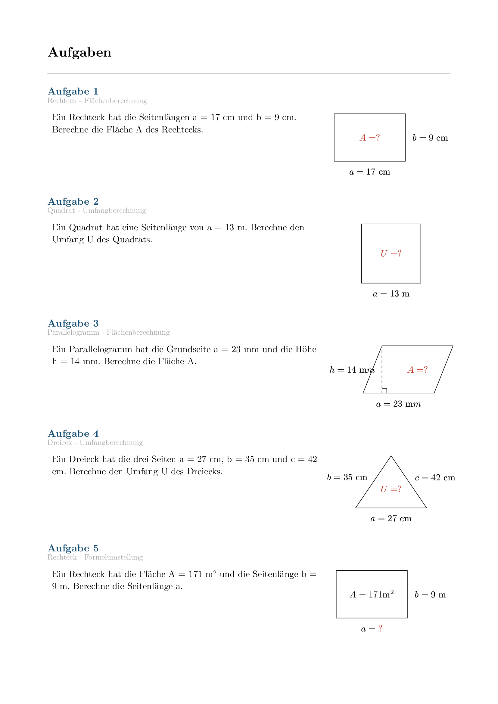
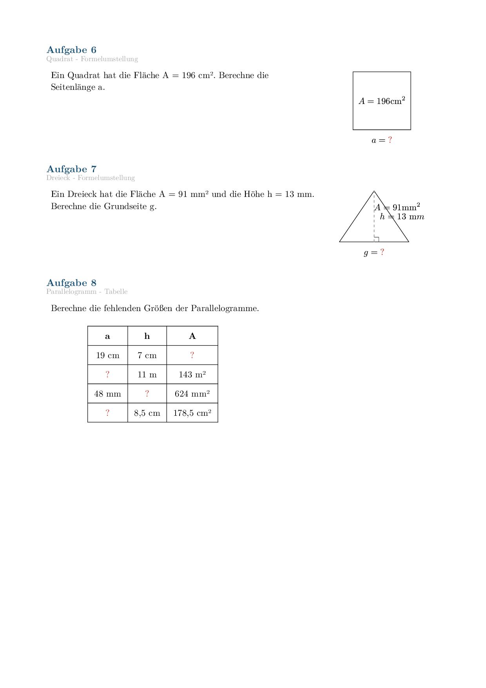
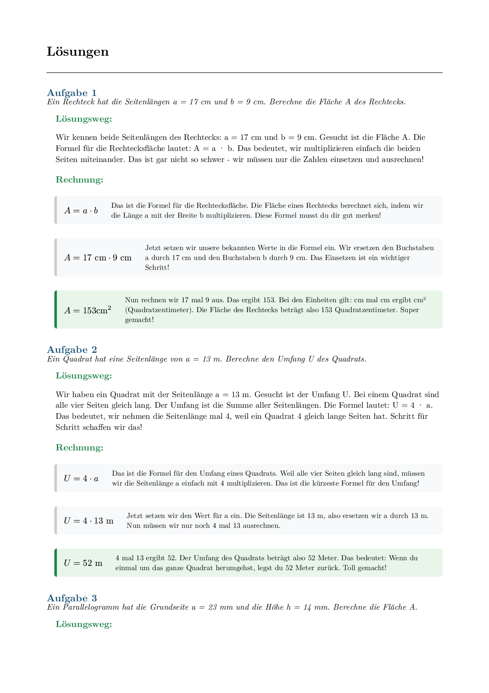

# Matheaufgaben-Generator

Ein Python-Skript zur automatischen Generierung von Mathematik-Übungsaufgaben für die 8. Klasse Realschule. Die Aufgaben werden als PDF mit professionellem mathematischem Satz (Typst) und geometrischen Skizzen erstellt.

## Funktionen

- Automatische Generierung von Geometrie-Aufgaben mit Claude AI
- Professioneller mathematischer Satz mit Typst
- Geometrische Skizzen zu jeder Aufgabe (CeTZ-Bibliothek)
- Ausführliche, schülerfreundliche Lösungswege
- Aufgabenblatt und Lösungsblatt in einem PDF

## Screenshots

### Aufgabenblatt





### Lösungsblatt



## Aufgabentypen

Das Skript generiert Aufgaben zu folgenden geometrischen Figuren und Berechnungen:

### Rechteck
- `rechteck-flaeche` - Flächenberechnung (A = a · b)
- `rechteck-umfang` - Umfangberechnung (U = 2a + 2b)
- `rechteck-umstellung` - Formelumstellung (z.B. gegebene Fläche, gesucht: Seite)

### Quadrat
- `quadrat-flaeche` - Flächenberechnung (A = a²)
- `quadrat-umfang` - Umfangberechnung (U = 4a)
- `quadrat-umstellung` - Formelumstellung (z.B. gegebene Fläche, gesucht: Seitenlänge)

### Dreieck
- `dreieck-flaeche` - Flächenberechnung (A = ½ · g · h)
- `dreieck-umfang` - Umfangberechnung (U = a + b + c)
- `dreieck-umstellung` - Formelumstellung (z.B. gegebene Fläche und Grundseite, gesucht: Höhe)

### Parallelogramm
- `parallelogramm-flaeche` - Flächenberechnung (A = a · h)
- `parallelogramm-umfang` - Umfangberechnung (U = 2a + 2b)
- `parallelogramm-umstellung` - Formelumstellung

### Tabellenaufgaben
- `tabelle-rechteck` - Tabelle mit 4 Rechtecken, fehlende Werte berechnen
- `tabelle-quadrat` - Tabelle mit 4 Quadraten
- `tabelle-dreieck` - Tabelle mit 4 Dreiecken
- `tabelle-parallelogramm` - Tabelle mit 4 Parallelogrammen

### Koordinatenaufgaben
- `koordinaten-rechteck` - Rechteck im Koordinatensystem einzeichnen und berechnen
- `koordinaten-quadrat` - Quadrat im Koordinatensystem
- `koordinaten-dreieck` - Dreieck im Koordinatensystem
- `koordinaten-parallelogramm` - Parallelogramm im Koordinatensystem

### Textaufgaben
- `textaufgabe` - Sachaufgaben mit Alltagsbezug (z.B. Teppich verlegen, Fliesen berechnen)

## Voraussetzungen

- Python 3.11 oder höher
- [uv](https://docs.astral.sh/uv/) (Python Package Manager)
- [Claude CLI](https://docs.anthropic.com/en/docs/claude-code) installiert und konfiguriert

## Installation

```bash
# Repository klonen
git clone <repository-url>
cd matheaufgaben

# Abhängigkeiten installieren (mit uv)
uv sync
```

## Verwendung

### 10 gemischte Aufgaben generieren

```bash
uv run python matheaufgaben.py
```

Dies generiert ein PDF mit 10 verschiedenen Aufgaben inkl. Lösungen.

### Mit Karokästchen (Lineatur 28)

```bash
uv run python matheaufgaben.py --karo
# oder kurz:
uv run python matheaufgaben.py -k
```

Fügt unter jeder Aufgabe ein kariertes Feld zum Rechnen hinzu.

### Einzelnen Aufgabentyp generieren

```bash
uv run python matheaufgaben.py --typ rechteck-flaeche
# oder kurz:
uv run python matheaufgaben.py -t quadrat-umstellung
```

### Alle verfügbaren Aufgabentypen anzeigen

```bash
uv run python matheaufgaben.py typen
```

## Ausgabe

Das Skript erstellt zwei Dateien im aktuellen Verzeichnis:

- `matheaufgaben_YYYYMMDD_HHMMSS.pdf` - Das fertige PDF mit Aufgaben und Lösungen
- `matheaufgaben_YYYYMMDD_HHMMSS.typ` - Die Typst-Quelldatei (für Debugging)

## Beispiel-Aufgaben

### Standardaufgabe mit Skizze
> Ein Rechteck hat die Seitenlängen a = 7 cm und b = 5 cm. Berechne die Fläche A.

Die Aufgabe wird mit einer beschrifteten Skizze des Rechtecks dargestellt.

### Tabellenaufgabe
> Berechne die fehlenden Größen der Rechtecke.

| a | b | U | A |
|---|---|---|---|
| 5 cm | 3 cm | ? | ? |
| ? | 7 m | ? | 28 m² |

### Koordinatenaufgabe
> Zeichne das Rechteck ABCD mit A(1|2), B(6|2), C(6|5), D(1|5) in das Koordinatensystem ein. Berechne Seitenlängen, Umfang und Fläche.

Ein leeres Koordinatensystem wird angezeigt.

## Lösungswege

Alle Lösungen enthalten:
- Ausführliche, schülerfreundliche Erklärungen
- Schritt-für-Schritt Rechenwege
- Farbliche Hervorhebung der Endergebnisse
- Bei Tabellenaufgaben: Ausgefüllte Lösungstabelle
- Bei Koordinatenaufgaben: Eingezeichnete Figur

## Technische Details

- **Typst**: Professionelles Textsatzsystem für mathematische Dokumente
- **CeTZ**: Typst-Bibliothek für geometrische Zeichnungen
- **Claude AI**: Generiert die Aufgaben mit zufälligen, abwechslungsreichen Zahlen
- **Typer**: CLI-Framework für die Benutzeroberfläche
